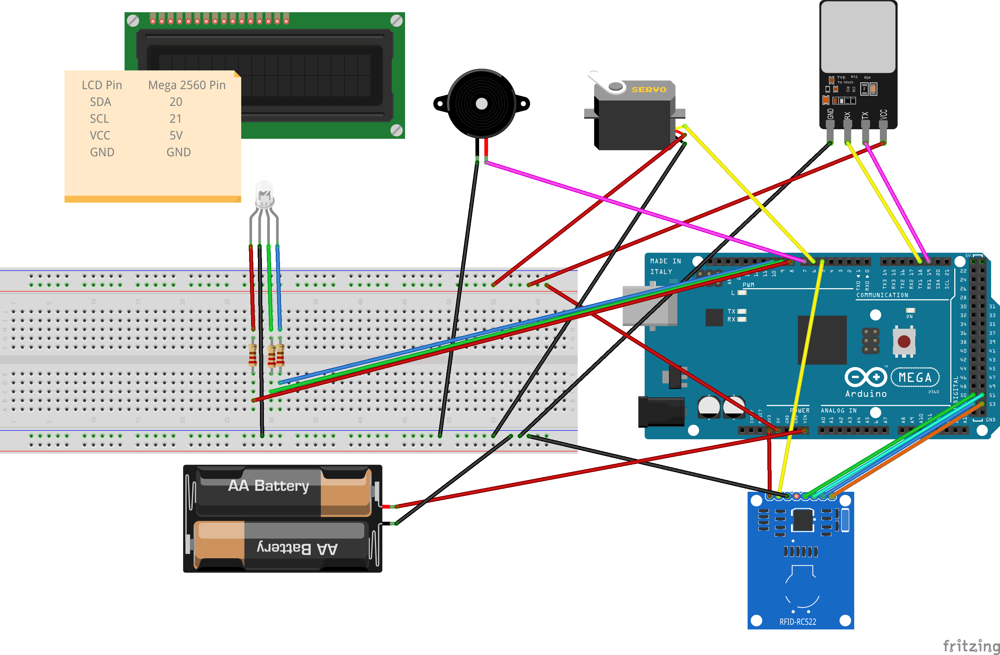

# Akıllı Giriş Kontrol Sistemi 🚪🔒

Arduino Mega 2560 kullanılarak geliştirilen bu proje, RFID kart ve parmak izi sensörü ile çalışan çift yetkili bir kapı sistemidir. Kullanıcılar LCD üzerinden bilgilendirilir.

## Proje Özeti
- **Kart Yetkisi (Kapı 1)**: Sadece RFID kart yetkisi olanlar için mavi LED ve kapı açma
- **Kart + Parmak İzi Yetkisi (Kapı 2)**: Parmak izi ve karta birlikte yetkisi olanlar için yeşil LED ve kapı açma
- **Yetkisiz Kullanım**: Kırmızı LED + buzzer uyarısı
- **Kayıt Modu**: İsim, Finger ID, UID, Yetki seviyesi (1 veya 2) kayıt edilir ve EEPROM’da saklanır

---

## Donanım Listesi
- Arduino Mega 2560
- MFRC522 RFID Okuyucu
- AS608 Parmak İzi Sensörü
- I2C LCD Ekran (16x2)
- Servo Motor
- RGB LED
- Buzzer
- Harici Güç Kaynağı (pil yatağı veya adaptör)

---

## Donanım Bağlantıları

### RFID (MFRC522)
| RFID Pin | Arduino Mega Pin |
|----------|------------------|
| SDA      | 53               |
| SCK      | 52               |
| MOSI     | 51               |
| MISO     | 50               |
| RST      | 5                |
| VCC      | 3.3V             |
| GND      | GND              |

### Parmak İzi Sensörü (AS608)
| Sensör Pin | Arduino Mega Pin |
|------------|------------------|
| TX         | 19 (RX1)         |
| RX         | 18 (TX1)         |
| VCC        | 5V               |
| GND        | GND              |

### I2C LCD (16x2)
| LCD Pin | Arduino Mega Pin |
|---------|------------------|
| SDA     | 20               |
| SCL     | 21               |
| VCC     | 5V               |
| GND     | GND              |

### Diğer Bileşenler
| Bileşen      | Arduino Mega Pin |
|--------------|------------------|
| Servo Motor  | 6                |
| Buzzer       | 7                |
| RGB LED - R  | 8                |
| RGB LED - G  | 9                |
| RGB LED - B  | 10               |

### Harici Güç Bağlantısı
- VCC: Arduino’nun VIN pinine
- GND: Arduino’nun GND pinine
- Gerilim aralığı: 7V – 12V arası önerilir

---

##  Kod Dosyaları
- `KayıtSistemKodu.ino` → Kişi ekleme, silme, listeleme, EEPROM'a yazma
- `KontrolSistemKodu.ino` → Giriş doğrulama ve servo motor kontrolü

---

## Devre Şeması

---

## Komutlar (Kayıt Modu İçin)
| Komut          | Açıklama                              |
|----------------|---------------------------------------|
| `A isim id`    | Yeni kişi ekle (örn: `A Tuana 1`)     |
| `L`            | Kayıtlı kişileri listele              |
| `D isim`       | İlgili ismi sil (örn: `D Tuana`)      |
| `S`            | Tüm kayıtları siler                   |

---

## Yazar
**Tuana**  
İstinye Üniversitesi – Bilgisayar Mühendisliği 3. Sınıf  
Projede kullanılan donanım ve yazılım, gömülü sistemler dersi kapsamında geliştirilmiştir.

